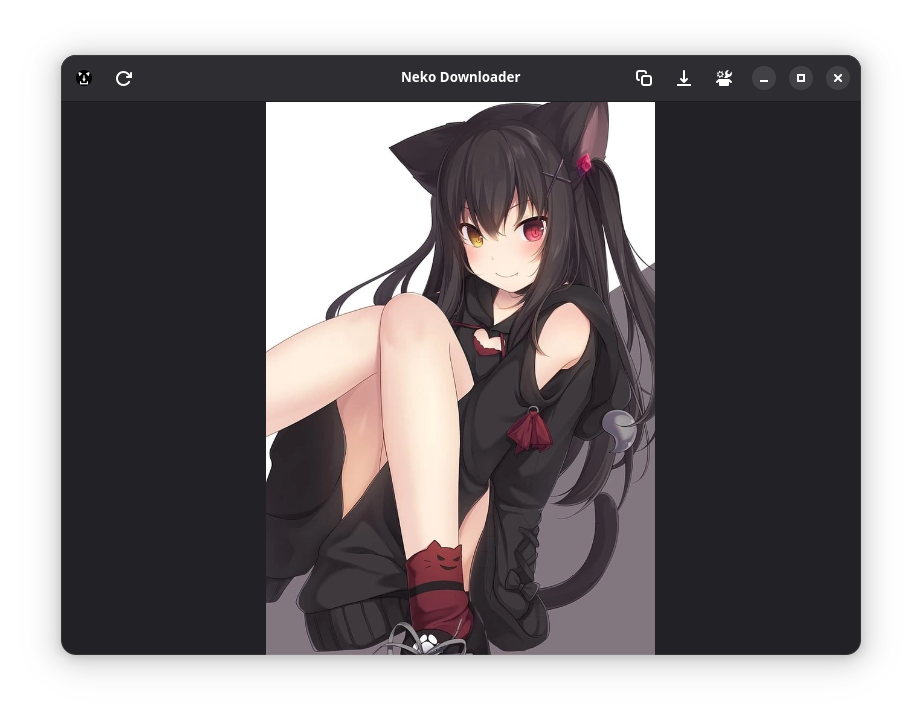

# Neko Downloader

Neko Downloader is a lightweight application that downloads random images from https://nekosapi.com.
Written in C and GTK4. 

## Features
- Download nekos!!!!
- Copy nekos in clipboard
- Scroll nekos for 8 hours and more!
- Secret functions...

## Install from Flathub
no coming soon...

## How to build 

1. Clone the repository.
2. Install gtk4, glib-2.0, json-glib-1.0, libadwaita-1, libcurl, libwebp, makefile, gcc.
3. Run in the project directory:

    `sudo make install`

4. You can uninstall application with:

    `sudo make uninstall`
